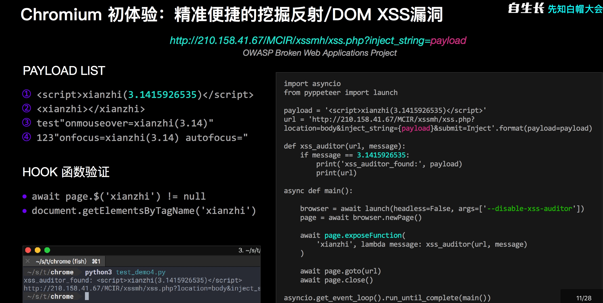
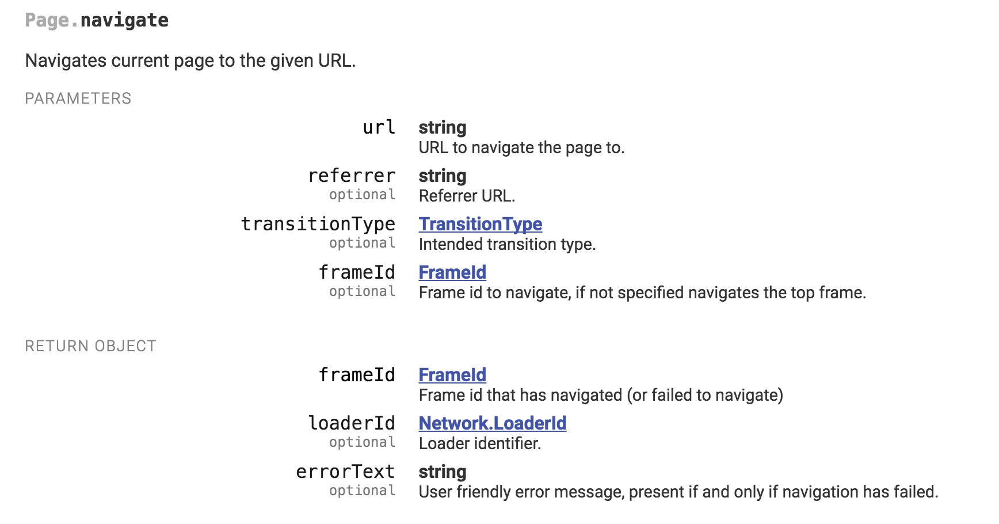
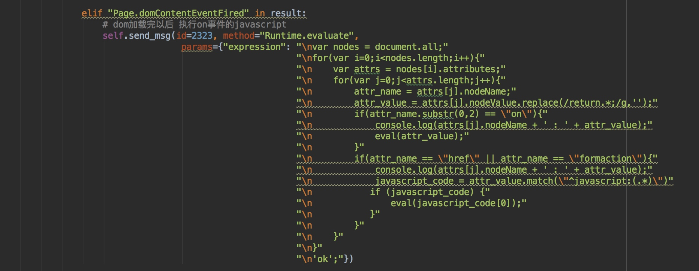
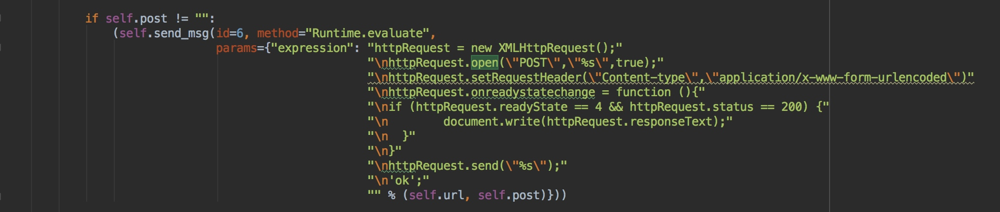

# **基于Chorme headless的xss检测**
## 源码及使用方法
Mac os 安装 chrome-canary：
```
brew install Caskroom/versions/google-chrome-canary
```
启动chrome远程调试：
```
chrome-canary --remote-debugging-port=9222 --headless -remote-debugging-address=0.0.0.0 --disable-xss-auditor --no-sandbox --disable-web-security
```
centos7：
安装chrome
```
$ vi /etc/yum.repos.d/google-chrome.repo
```
写入如下内容：
```
[google-chrome]
name=google-chrome
baseurl=http://dl.google.com/linux/chrome/rpm/stable/$basearch
enabled=1
gpgcheck=1
gpgkey=https://dl.google.com/linux/linux_signing_key.pub
```
然后
```
$ sudo yum install google-chrome-stable
```
后台启动chrome-stable
```
nohup google-chrome-stable --disable-gpu --remote-debugging-port=9222 --headless -remote-debugging-address=0.0.0.0 --disable-xss-auditor --no-sandbox --disable-web-security > chromeheadless.out 2>&1 & 
```
chrome_headless_xss
```
# tmp_url为添加payload的url，如果是post请求则为原始url
chrome_headless_drive = ChromeHeadLess(url=tmp_url,
ip="127.0.0.1",
port="9222",
cookie="",
post="",
auth="",
payloads= payload)
scan_result = chrome_headless_drive.run()
```
scan_result结果：
```
# level 3 代表触发了Page.javascriptDialogOpening事件
{'url': u'http://xss.php', 'vul': 'xss', 'post': '', 'method': u'GET', 'level': '3'}
# level 2 代表dom树的节点包含了我们自定义的<webscan></webscan>标签
{'url': u'http://xss.php', 'vul': 'xss', 'post': '', 'method': u'GET', 'level': '2'}
# level 1 代表渲染后的nodeValue包含我们的payload
{'url': u'http://xss.php', 'vul': 'xss', 'post': u'id1=1&id2=2test_test', 'method': u'POST', 'level': '1'}
```
源码链接：
```
https://github.com/neverlovelynn/chrome_headless_xss/
```
## 起因：
  扫描器不能满足需求，phantomjs不支持html5标签。所以自己查阅资料和api，写了一个基于chrome headless xss扫描插件。
  
总体思路来自于：
fridayy的基于phantomjs的xss扫描https://paper.seebug.org/93/

以及猪猪侠的web2.0启发式爬虫实战



判断xss的方法为：

1、	监听页面的弹窗事件

2、	查看dom中的localName是否有存在我们自定义的标签

3、	查看dom中的nodeValue 是否含有我们输入的payload

将其分为三个等级，分别为level 3 level 2 level 1 分别对应这xss的精确程度（由高到低）

## 了解chrome_headless

初步了解，可以看一下大佬的blog: https://thief.one/2018/03/06/1/
你可以通过它来做很多事情，但是这里不讨论其他功能，只着眼于xss的判断。

总体来说，headless chrome意思是无头chrome浏览器，相对于传统的chrome浏览器，这是一个可以在后台用命令行操作浏览器的工具，对于爬虫编写以及web自动化测试都有很大的作用。相比较同类工具Phantomjs，其更加强大（主要因为其依赖的webkit更新）。

我认为核心的理解在于：

1、	就是具有基于Chrome DevTools Protocol 的chrome远程调试功能的无界面浏览器。

2、	现在的python和nodejs对chrome headless进行操作的封包都是基于Chrome DevTools Protocol来实现的。

学习了一下：https://github.com/wilson9x1/ChromeHeadlessInterface 的项目后，决定自己使用webscoket和chrome进行通信。
原因有以下几点：

1、有现成的部分代码，但是不支持post，也不能监听dom的更改。所以需要自己读api去实现我们的功能。

2、比较直观，可以通过本地远程调试端口看页面的变化。

与chrome通信的基本知识：
简单说一下这套协议吧，这套协议通过 websocket 进行通信，发送和返回的内容都是 json 格式。发送的格式大概是这样：
```
{
"id": id,
"method": command,
"params": params
    
 }
```
换成一个实际的例子可能是这样：
```
{"id": 1,
"method: "Page.enable",
"params": {}
}

{
"id": 2,
"method": "Page.navigate",
"params": {"url": "https://www.github.com"}
}
```
几个关键的url：

http://localhost:9222/json

http://localhost:9222/json/new 

http://localhost:9222/json/close/tab_id


其中第一个 URL 是获取当前所有打开的 TAB 页，第二个是新建一个 TAB 页，第三个是根据 TAB 页的 id 关闭这个 TAB 页。
当我们请求第一个 URL 时，返回的内容大概如下：
```
[
{
"description": "",
"id": "c33a4799-13e0-4b6a-b636-fd717c32c941",
"title": "a.html",
"type": "page",
"url": "http://x.x.x.x/a.html"
},
{
"description": "",
"devtoolsFrontendUrl": "/devtools/inspector.html?ws=localhost:9222/devtools/page/1adf9b16-5cca-483e-874a-2a53f4b131ca",
"id": "1adf9b16-5cca-483e-874a-2a53f4b131ca",
"title": "about:blank",
"type": "page",
"url": "about:blank",
"webSocketDebuggerUrl": "ws://localhost:9222/devtools/page/1adf9b16-5cca-483e-874a-2a53f4b131ca"
}
]
```
这里面可以拿到每个 TAB 页的详细信息。

第二个新建 TAB 页访问之后，也会返回新 TAB 页的信息。其中就有一个很重要的字段：webSocketDebuggerUrl，这个就是我们要拿的 websocket 的地址。

Page.navigate命令

其socket返回包为
```
{"id":2,"result":{"frameId":"33320.1"}}
{"method":"Page.frameNavigated","params":{"frame":
{"id":"33320.1","loaderId":"33320.2","url":"http://x.x.x.x/a.html","securityOrigin":"http://x.x.x.x","mimeType":"text/html"}}}

{"method":"Page.javascriptDialogOpening","params":
{"message":"9527","type":"alert"}}

{"method":"Page.javascriptDialogClosed","params":
{"result":true}}

{"method":"Page.loadEventFired","params":{"timestamp":131319.852874}}

{"method":"Page.frameStoppedLoading","params":
{"frameId":"33320.1"}}

{"method":"Page.domContentEventFired","params":{"timestamp":131319.853225}

```
从内容可以看出来是页面渲染时浏览器通知客户端浏览器发生的事件。

## 漏洞判别标准及如何实现
1、	监听页面的弹窗事件：
通过循环监听Page.javascriptDialogOpening的结果，判断页面是否存在弹窗事件。
其socket回包是：
```
{"method":"Page.javascriptDialogOpening","params":
{"url":"http://xss.php","message":"1","type":"alert","hasBrowserHandler":false,"defaultPrompt":""}
}
```
2、	查看dom中的localName是否有存在我们自定义的标签
通过循环监听DOM.getDocument的return来判断我们自定义的标签是否被解析。其数据包如下：
```
{"id":2324,"result":{"root":{"nodeId":30453,"backendNodeId":6,"nodeType":9,"nodeName":"#document","localName":"","nodeValue":"","childNodeCount":1,"children":[{"nodeId":30454,"parentId":30453,"backendNodeId":7,"nodeType":1,"nodeName":"HTML","localName":"html","nodeValue":"","childNodeCount":2,"children":[{"nodeId":30455,"parentId":30454,"backendNodeId":8,"nodeType":1,"nodeName":"HEAD","localName":"head","nodeValue":"","childNodeCount":0,"children":[],"attributes":[]},{"nodeId":30456,"parentId":30454,"backendNodeId":9,"nodeType":1,"nodeName":"BODY","localName":"body","nodeValue":"","childNodeCount":4,"children":[{"nodeId":30457,"parentId":30456,"backendNodeId":10,"nodeType":1,"nodeName":"TABLE","localName":"table","nodeValue":"","childNodeCount":1,"children":[{"nodeId":30458,"parentId":30457,"backendNodeId":11,"nodeType":1,"nodeName":"TBODY","localName":"tbody","nodeValue":"","childNodeCount":2,"children":[{"nodeId":30459,"parentId":30458,"backendNodeId":12,"nodeType":1,"nodeName":"TR","localName":"tr","nodeValue":"","childNodeCount":2,"children":[{"nodeId":30460,"parentId":30459,"backendNodeId":13,"nodeType":1,"nodeName":"TD","localName":"td","nodeValue":"","childNodeCount":1,"children":[{"nodeId":30461,"parentId":30460,"backendNodeId":14,"nodeType":3,"nodeName":"#text","localName":"","nodeValue":"id"}],"attributes":[]},{"nodeId":30462,"parentId":30459,"backendNodeId":15,"nodeType":1,"nodeName":"TD","localName":"td","nodeValue":"","childNodeCount":1,"children":[{"nodeId":30463,"parentId":30462,"backendNodeId":16,"nodeType":3,"nodeName":"#text","localName":"","nodeValue":"username"}],"attributes":[]}],"attributes":[]},{"nodeId":30464,"parentId":30458,"backendNodeId":17,"nodeType":1,"nodeName":"TR","localName":"tr","nodeValue":"","childNodeCount":2,"children":[{"nodeId":30465,"parentId":30464,"backendNodeId":18,"nodeType":1,"nodeName":"TD","localName":"td","nodeValue":"","childNodeCount":0,"children":[],"attributes":[]},{"nodeId":30466,"parentId":30464,"backendNodeId":19,"nodeType":1,"nodeName":"TD","localName":"td","nodeValue":"","childNodeCount":1,"children":[{"nodeId":30467,"parentId":30466,"backendNodeId":20,"nodeType":3,"nodeName":"#text","localName":"","nodeValue":"jim"}],"attributes":[]}],"attributes":[]}],"attributes":[]}],"attributes":["class","itable","border","1","cellspacing","0","width","300px","height","150"]},{"nodeId":30468,"parentId":30456,"backendNodeId":21,"nodeType":1,"nodeName":"TABLE","localName":"table","nodeValue":"","childNodeCount":1,"children":[{"nodeId":30469,"parentId":30468,"backendNodeId":22,"nodeType":1,"nodeName":"TBODY","localName":"tbody","nodeValue":"","childNodeCount":2,"children":[{"nodeId":30470,"parentId":30469,"backendNodeId":23,"nodeType":1,"nodeName":"TR","localName":"tr","nodeValue":"","childNodeCount":2,"children":[{"nodeId":30471,"parentId":30470,"backendNodeId":24,"nodeType":1,"nodeName":"TD","localName":"td","nodeValue":"","childNodeCount":1,"children":[{"nodeId":30472,"parentId":30471,"backendNodeId":25,"nodeType":3,"nodeName":"#text","localName":"","nodeValue":"id"}],"attributes":[]},{"nodeId":30473,"parentId":30470,"backendNodeId":26,"nodeType":1,"nodeName":"TD","localName":"td","nodeValue":"","childNodeCount":1,"children":[{"nodeId":30474,"parentId":30473,"backendNodeId":27,"nodeType":3,"nodeName":"#text","localName":"","nodeValue":"username"}],"attributes":[]}],"attributes":[]},{"nodeId":30475,"parentId":30469,"backendNodeId":28,"nodeType":1,"nodeName":"TR","localName":"tr","nodeValue":"","childNodeCount":2,"children":[{"nodeId":30476,"parentId":30475,"backendNodeId":29,"nodeType":1,"nodeName":"TD","localName":"td","nodeValue":"","childNodeCount":0,"children":[],"attributes":[]},{"nodeId":30477,"parentId":30475,"backendNodeId":30,"nodeType":1,"nodeName":"TD","localName":"td","nodeValue":"","childNodeCount":0,"children":[],"attributes":[]}],"attributes":[]}],"attributes":[]}],"attributes":["class","itable","border","1","cellspacing","0","width","300px","height","150"]},{"nodeId":30478,"parentId":30456,"backendNodeId":31,"nodeType":3,"nodeName":"#text","localName":"","nodeValue":"select * from users where id = 1select * from users where id = 2"},{"nodeId":30479,"parentId":30456,"backendNodeId":32,"nodeType":1,"nodeName":"WEBSCAN","localName":"webscan","nodeValue":"","childNodeCount":0,"children":[],"attributes":[]}],"attributes":[]}],"attributes":[],"frameId":"374820F555469428D6636693E4F63022"}],"documentURL":"http://xss.php%3Cwebscan%3E%3C/webscan%3E","baseURL":"http://xss.php%3Cwebscan%3E%3C/webscan%3E","xmlVersion":""}}}
```
3、	通过解析DOM.getDocument的return里的 nodeValue来判断payload是否存在于最后渲染的页面里。

一些细节:

1、	如何触发事件的弹窗，通过遍历dom树触发事件来触发onerror=alert之类的弹窗



2、	如何支持post请求：




chrome远程调试的配置：
```
chrome-canary --remote-debugging-port=9222 --headless -remote-debugging-address=0.0.0.0 --disable-xss-auditor --no-sandbox --disable-web-security
```
这里关闭了xss-auditor 和安全相关的一些参数。所以事实上如果不对参数进行处理部署在内网可能会导致ssrf的情况。

三种不同的判断逻辑的结果：
scan_result结果：

```
# level 3 代表触发了Page.javascriptDialogOpening事件
{'url': u'http://xss.php', 'vul': 'xss', 'post': '', 'method': u'GET', 'level': '3'}
# level 2 代表dom树的节点包含了我们自定义的<webscan></webscan>标签
{'url': u'http://xss.php', 'vul': 'xss', 'post': '', 'method': u'GET', 'level': '2'}
# level 1 代表渲染后的nodeValue包含我们的payload
{'url': u'http://xss.php', 'vul': 'xss', 'post': u'id1=1&id2=2test_test', 'method': u'POST', 'level': '1'}
```


## 总结及思考

1、	其实使用websocket和chrome进行通信整个过程是异步的，使用异步的方法可以解决粗暴的通过超时来控制循环监听的问题，同时也能提高扫描效率。

2、	在关闭了同源策略的情况下，可能会导致内网ssrf，所以要对传入参数进行处理。可以尝试用其他方法实现post请求，如在Network.requestWillBeSent时修改请求参数。

3、	由于企业内部对qps有限制，我们扫描的payload数量会被限制的很少。不能进行fuzz，如果需要fuzz模块可以参考 https://github.com/bsmali4/xssfork 的fuzz模块进行payload的fuzz。

